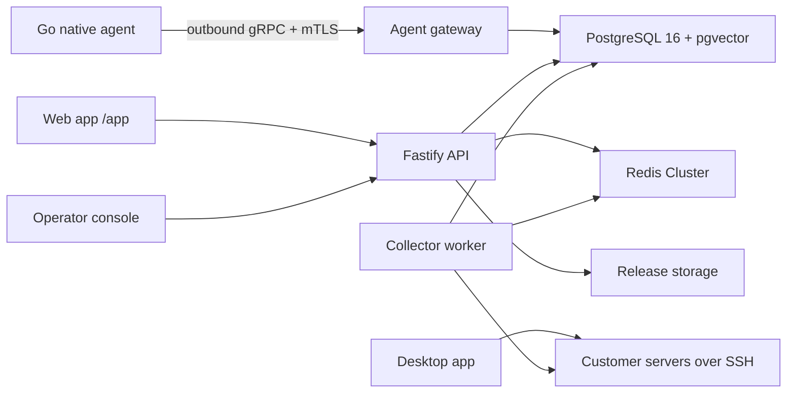

<div align="center">

# monitc

**A calm operations workspace for servers, containers and Kubernetes — on desktop, self-hosted, or managed cloud.**

[](LICENSE)
[](https://electronjs.org)
[](https://react.dev)
[](https://nodejs.org)
[](https://postgresql.org)

[Website](https://monitc.talhacan.com) · [Web app](https://monitc.talhacan.com/app) · [Releases](../../releases) · [Security](SECURITY.md) · [Deployment](docs/DEPLOYMENT.md)

</div>

---

## One product, three deployment modes

| Mode | Best for | Where data lives | Runtime |
|---|---|---|---|
| Desktop | Individual operators and local-first workflows | On the user's computer | Electron on macOS, Windows or Linux |
| Self-hosted | Teams that want full infrastructure control | On the team's Linux host | Docker Compose |
| Managed cloud | Teams that want monitc operated for them | Encrypted records in the monitc platform | Kubernetes |

The desktop application remains fully usable without an account. The web platform adds accounts,
workspaces, plan limits, background collection, browser terminal/SFTP, audit trails and a dedicated
operator console.

## Highlights

- Hybrid server access: a lightweight Go agent for outbound, high-resolution telemetry with SSH
  retained for terminal, SFTP and agentless fallback.
- TLS 1.3 mutual authentication, one-time pairing and short-lived workload certificates for every
  native agent.
- Plan-aware native sampling from 5 seconds down to 250 milliseconds, durable offline buffering
  and optional eBPF event aggregation.
- Kubernetes pod allocation and usage: CPU requests/limits/usage, memory requests/limits/usage,
  restart state and per-pod receive/transmit rates.
- Native Docker workload telemetry: container state, CPU, memory limit/usage and receive/transmit
  rates in the web workload fleet.
- Docker and Kubernetes inventory and operations in the desktop client.
- Browser and desktop SSH terminals.
- SFTP navigation, editor, upload/download, create, copy, cut, paste, move and recursive delete.
- Sustained metric alert rules with cooldown and in-app event history.
- Four plans with server, seat, retention, poll interval and capability entitlements.
- A separate Linear-inspired platform console for workspace, user, plan request, release and audit
  administration.
- Signed desktop releases with an in-app update prompt and resumable **Later** flow.

## Platform architecture


```mermaid
flowchart LR
  D["Desktop app"] --> S["Customer servers over SSH"]
  B["Web app /app"] --> A["Fastify API"]
  C["Operator console"] --> A
  G["Go native agent"] -->|"outbound gRPC + mTLS"| AG["Agent gateway"]
  AG --> P
  A --> P["PostgreSQL 16 + pgvector"]
  A --> R["Redis Cluster"]
  A --> U["Release storage"]
  W["Collector worker"] --> P
  W --> R
  W --> S
```

The managed installation runs in the isolated `monitc` Kubernetes namespace:

- two API replicas behind a NodePort service;
- two web replicas and two admin replicas;
- one background collector worker;
- a dedicated native-agent gRPC gateway and private certificate authority volume;
- PostgreSQL 16 with pgvector;
- three Redis master pods with persistent AOF storage;
- daily verified PostgreSQL backups with 14-day local retention;
- resource limits, read-only application filesystems, seccomp, NetworkPolicies, HPA and PDB.

On a single physical K3s node, multiple Redis/API pods provide process-level resilience, not
physical-node high availability. Real node HA requires multiple Kubernetes nodes and off-node
database/backup replicas.

## Production endpoints

The browser surfaces use three HTTP hosts. Native agents use one additional raw TLS endpoint:

| Host | Purpose | Reverse-proxy target |
|---|---|---|
| `monitc.talhacan.com` | Landing page, `/app`, desktop downloads and `/updates` | `127.0.0.1:9127` |
| `monitc-api.talhacan.com` | REST API and terminal WebSocket | `127.0.0.1:9128` |
| `monitcap.talhacan.com` | Private platform operator console | `127.0.0.1:9129` |
| `monitc-agent.talhacan.com` | Native-agent gRPC over TLS | TCP/TLS passthrough to host port `9130` |

Enable WebSocket proxying on the API host, force HTTPS, and preserve the `/updates` path on the
main host. The agent endpoint is not an HTTP reverse proxy: configure raw TCP/TLS passthrough with
SNI preserved, or point the DNS record directly at a firewall-restricted listener on port `9130`.
Until the managed `:443` route resolves, the hosted installer verifies and uses
`45.131.1.244:9130` while retaining `monitc-agent.talhacan.com` as the TLS server name. Custom and
self-hosted gateways never fall back unless their operator explicitly configures an address.

## Security model

monitc does not store SSH credentials or personal fields as plaintext:

- the browser seals SSH material with a libsodium X25519 sealed box before upload;
- PostgreSQL stores only SSH ciphertext and a key identifier;
- the collector decrypts a credential only in worker memory for the duration of an SSH operation;
- email, display name, workspace/server/alert names and contact text use application-layer
  AES-256-GCM encryption with context-bound authenticated data;
- normalized email lookup uses a separate HMAC blind-index key;
- passwords use Argon2id plus an optional application pepper;
- access tokens are short-lived Ed25519 JWTs with strict `alg`, `typ`, issuer and audience checks;
- refresh tokens are opaque, one-time rotating, hashed in PostgreSQL and protected by replay-family
  revocation;
- browser access tokens stay in memory; refresh tokens use a host-only `HttpOnly`, `Secure`,
  `SameSite=Strict` cookie;
- workspace RBAC and plan entitlements are enforced by the API, not only by the UI;
- native agents pair with a one-time token whose digest is stored server-side, then use a
  SPIFFE-shaped URI identity in a short-lived ECDSA client certificate;
- the agent gateway requires TLS 1.3, validates workspace/server/certificate binding, rejects
  replayed sequences and limits pairing attempts;
- managed mode rejects loopback, link-local and private SSH destinations to reduce SSRF risk;
- logs redact credentials, cookies and authorization headers.

Agent-only servers need no stored SSH secret: the private key remains on the monitored host and the
connection is always initiated outbound. If SSH fallback is enabled, continuous managed access is
not a zero-knowledge design: an authorized worker can decrypt that selected credential in memory.
Database theft alone does not reveal it, but loss of the vault key and database together would.
Keep vault, PII, JWT and agent-CA keys outside PostgreSQL and back them up separately.

See [SECURITY.md](SECURITY.md) for boundaries, key handling, dependency notes and operational
requirements. The native protocol, provider boundary and operational model are documented in
[docs/NATIVE_AGENT.md](docs/NATIVE_AGENT.md).

## Plans

| Plan | Servers | Seats | Retention | SSH poll | Native sample | Main capabilities |
|---|---:|---:|---:|---:|---:|---|
| Community | 2 | 1 | 1 day | 60 s | 5 s | Desktop, self-hosted and workload visibility |
| Solo | 5 | 1 | 30 days | 30 s | 1 s | Web terminal, SFTP and alerts |
| Team | 25 | 5 | 90 days | 15 s | 500 ms | RBAC, audit log and priority support |
| Scale | Custom | Custom | 365 days | 10 s | 250 ms | Custom limits, onboarding and SLA |

There is intentionally no payment provider in this release. Selecting a paid plan creates a
contact request; a platform administrator can review it and assign the plan manually from the
private operator console.

## Desktop

### Install

```bash
brew tap Rampesna/tap
brew install --cask monitc
```

Direct `.dmg`, Windows installer, AppImage and Debian packages are published on
[GitHub Releases](../../releases).

### Develop

```bash
npm ci
npm run dev
```

### Build

```bash
npm run build
npm run build:mac
npm run build:win
npm run build:linux
```

Packaged clients read the generic update feed at
`https://monitc.talhacan.com/updates`. After choosing **Later**, the update remains available in
the header and under **Settings → General → Application updates**.

## Web platform development

Requirements: Node.js `22.22+`, npm `10+`, PostgreSQL 16 with pgvector, and Redis 7.

```bash
npm ci --prefix platform
cp platform/.env.example platform/.env
npm run typecheck --prefix platform
npm test --prefix platform
npm run build --prefix platform
```

The workspace contains:

```text
platform/
├── apps/api       Fastify REST/WebSocket API and collector worker
├── apps/web       Customer React application, served at /app
├── apps/admin     Private platform operator React application
└── packages/shared
```

Production secrets can be generated once with:

```bash
node platform/scripts/generate-production-env.mjs .env.production
```

The generator preserves an existing file and writes new files with mode `0600`. Never regenerate
keys over an existing encrypted database.

## Self-hosted Linux

The self-hosted profile binds to loopback by default and uses one PostgreSQL instance, one
standalone Redis instance, API, worker, web and a daily backup service.

```bash
npm ci --prefix platform
DEPLOYMENT_MODE=self-hosted \
APP_ORIGIN=https://monitc.example.com \
API_ORIGIN=https://monitc-api.example.com \
ADMIN_ORIGIN=https://monitc-admin.example.com \
node platform/scripts/generate-production-env.mjs infra/self-hosted/.env

docker compose --env-file infra/self-hosted/.env \
  -f infra/self-hosted/docker-compose.yml up -d --build
```

Point the web proxy to `127.0.0.1:9127`, the API/WebSocket proxy to `127.0.0.1:9128`, and the
optional instance operator console to `127.0.0.1:9129`. Route a raw TCP/TLS agent endpoint to
`127.0.0.1:9130`; do not place the gRPC listener behind an HTTP-only proxy. Full instructions are in
[infra/self-hosted/README.md](infra/self-hosted/README.md).

## Managed Kubernetes deployment

On the production K3s host:

```bash
cd /www/wwwroot/monitc
./infra/scripts/deploy-manual.sh
```

The script:

1. creates production secrets only on the first install;
2. builds revision-tagged API, web, admin and native-agent gateway images;
3. cross-compiles checksum-pinned Linux amd64/arm64 agent artifacts;
4. makes the images available to the configured K3s runtime;
5. applies the `monitc` namespace, data services and application manifests;
6. waits for each rollout;
7. verifies health, pgcrypto/pgvector, Redis cluster state, agent PKI and workloads.

GitHub Actions contains an SSH-based production workflow for later use. Until the Actions quota is
available, use the same manual script after a fast-forward pull. See
[docs/DEPLOYMENT.md](docs/DEPLOYMENT.md) for proxy, backup, recovery and CI/CD details.

## Desktop release process

A stable `vX.Y.Z` tag on `main` triggers `.github/workflows/release.yml`. It validates version
consistency, builds each OS package, requires signed/notarized macOS output, verifies updater
metadata, publishes the GitHub release and synchronizes the update feed over pinned SSH.

```bash
npm run release:verify -- v1.5.1
git tag -a v1.5.1 -m "monitc v1.5.1"
git push origin v1.5.1
```

Required release and deployment secrets are documented in
[docs/DEPLOYMENT.md](docs/DEPLOYMENT.md).

## Verification

```bash
npm run build
npm run release:verify
npm run typecheck --prefix platform
npm test --prefix platform
npm run build --prefix platform
npm run build --prefix website
cd agent && go vet ./... && go test -race ./...
docker compose --env-file infra/self-hosted/.env \
  -f infra/self-hosted/docker-compose.yml config
```

Live verification:

```bash
./infra/scripts/verify-live.sh
kubectl -n monitc get pods,svc,hpa,pdb,pvc
```

## License

[MIT](LICENSE)
