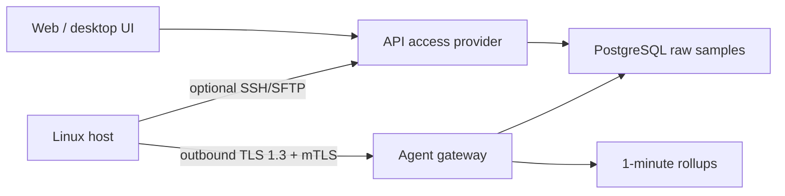

# Native agent architecture

Monitc uses a hybrid provider model. Host, Docker and Kubernetes telemetry can
arrive through the native agent, while terminal and file operations continue to
use the mature SSH/SFTP path when an encrypted SSH fallback is configured.
Transport-specific connection tests are resolved through the API's
`ServerProvider` registry. Both ingestion paths write the same normalized
metric models, so history, alerts and dashboard queries stay provider-neutral;
the UI receives only connection mode and capability metadata needed to explain
whether SSH-only terminal/file actions are available.



## Why Go and where eBPF fits

The agent is a static Go binary for Linux AMD64 and ARM64. Host metrics come
directly from procfs and syscalls; Docker data comes from the local Unix socket;
Kubernetes inventory comes from the configured `kubectl` and kubelet summary
API. It does not run a shell command for every host sample.

The optional eBPF module attaches small counter programs to
`sched:sched_switch` and `tcp:tcp_retransmit_skb`. Kernel events carry a
monotonic nanosecond clock, but Monitc aggregates them inside each sample
window. This is deliberately different from writing one database record per
microsecond:

- plan-controlled host sampling is 5 s, 1 s, 500 ms or 250 ms;
- collection duration is retained in nanoseconds and displayed as ns/µs/ms;
- eBPF event counts and the last monotonic event timestamp describe activity
  inside the window;
- one-minute rollups preserve trends without turning PostgreSQL into an event
  firehose.

## Pairing and identity

1. A workspace operator creates an agent-mode server.
2. The API returns a 256-bit, 15-minute, one-time pairing token. PostgreSQL
   stores only its SHA-256 digest and a short non-secret hint.
3. The agent generates an ECDSA P-256 private key and CSR locally.
4. The gateway consumes the token in a serializable transaction and issues a
   seven-day client certificate with a
   `spiffe://<trust-domain>/agent/<agent-id>` URI identity.
5. All subsequent RPCs require TLS 1.3 and that client certificate. Rotation
   begins 24 hours before expiry.

This is SPIFFE-shaped workload identity, not a claim that the current built-in
CA is a complete SPIRE deployment. The CA private key stays in the dedicated
`agent-pki` volume. A one-shot exporter copies only `ca.crt` into a separate
public volume, so the bootstrap API container cannot read the CA key.

## Streaming and offline behavior

The protobuf contract lives in
`agent/proto/monitc/agent/v1/agent.proto`. A long-lived bidirectional gRPC
stream carries:

- hello and capability negotiation;
- batched host samples;
- Docker and Kubernetes inventory snapshots;
- heartbeat and bounded-spool status;
- per-boot sequence acknowledgements;
- deny-by-default command responses and future signed update directives.

Samples are written deterministically to a local protobuf spool before being
sent. The default 256 MiB cap evicts the oldest complete batch when necessary.
Acknowledged batches are deleted only after PostgreSQL commits. Reconnect uses
bounded exponential backoff with jitter.

The gateway treats even an authenticated agent as untrusted input. It validates
identity, boot UUID, sequence uniqueness, timestamps, sample intervals,
floating-point ranges, inventory cardinality/string limits and enabled
capabilities before opening a database transaction.

## Install

Create an agent-mode server from **Servers → Add server**, then run the command
shown by Monitc:

```bash
curl -fsSL https://monitc.talhacan.com/install-agent.sh | sudo bash
```

Paste the one-time token at the hidden `/dev/tty` prompt. For unattended
provisioning, pass the token through the process environment of the
provisioning job:

```bash
curl -fsSL https://monitc.talhacan.com/install-agent.sh |
  sudo MONITC_AGENT_PAIRING_TOKEN="<one-time-token>" bash
```

The environment value and temporary token file are removed from the running
agent flow after successful pairing. Avoid putting reusable credentials in
automation logs; the pairing value is single-use but should still be treated as
a secret until consumed.

## Network requirement

`monitc-agent.talhacan.com:443` must be a raw TCP/TLS passthrough to host port
`9130`. A normal HTTP reverse proxy must not terminate the client
certificate. Agents need outbound TCP 443 only; no inbound agent port or SSH
credential is required for telemetry.

## Capability boundary

The initial native release enables only:

- host metrics;
- read-only Docker inventory and resource telemetry;
- read-only Kubernetes inventory and resource telemetry;
- optional eBPF counters.

Remote command execution, agent file read/write and self-update are represented
in the protocol but remain deny-by-default in the service configuration. SSH
continues to power terminal and SFTP. This keeps the migration incremental and
prevents a telemetry agent from silently becoming a general remote-execution
daemon.

## Development and verification

```bash
cd agent
go test -race ./...
GOOS=linux GOARCH=amd64 CGO_ENABLED=0 go build ./...
GOOS=linux GOARCH=arm64 CGO_ENABLED=0 go build ./...
```

The release workflow builds both Linux architectures, publishes SHA-256 sidecar
files and stages versioned artifacts under `/agent/vX.Y.Z/`. Linux runtime
verification must include a real kernel test because an unprivileged container
correctly falls back when eBPF capabilities or tracepoints are unavailable.
